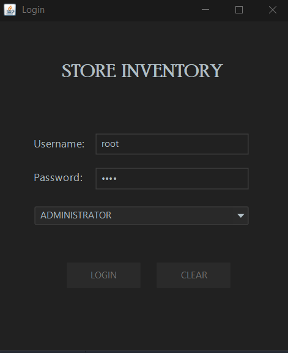

# Inventory Management System

This is an Inventory Management System built in the form of a GUI desktop application developed in ***Java*** using ***MySQL*** as its database.
The GUI was designed using **Swing** and the database connectivity was managed using **JDBC API**.

This application can be used by any small to mid-sized stores to easily maintain and manage an inventory of all their-
- Products 
- Customers 
- Suppliers
- Users 
- Transactions

## Features of the Application

- Users can manage inventory and stock of all the products available in their store.
- Users can manage all sales and purchase transactions made by the store.
- Supports two user types:
  1. Administrator
  2. Employee
  
  [Admins have the ability to manage all other personnel.]
- Any transaction made automatically handles the stock availability in the inventory.
- Each section includes a search feature to make it easier for users to view the data they want to see.
- Users only need to enter the product code while making a sale and all the relevant details will be retrieved from the database automatically.
- Maintains a time log of all the users using the application.

## Application Preview

### Login Page

The login page takes in the credentials entered by the user and verifies with the database.

### Dashboard/Welcome Page

